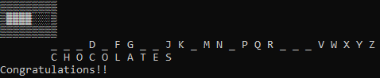
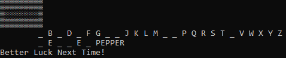

# Hangman



# FAQ
* [What is Hangman?](https://en.wikipedia.org/wiki/Hangman)(Ctrl + click) the link
* Does this work on Linux?
    - Sadly no, due to libraries used in the code.
* Does this work on Windows
    - Yes, below instructions are provided.

# Install for windows
1. Download zip to Downloads
2. Unzip Hangman-master
    * right-click & **extract here**
3. [gcc/g++ Compilers (used to compile and play)](https://iweb.dl.sourceforge.net/project/tdm-gcc/TDM-GCC%20Installer/tdm64-gcc-5.1.0-2.exe)(Ctrl + click) the link
    * run & install
    * Video on how to install the compilers [Compiler Installation Tutorial](https://youtu.be/w23QyVb1Jx4)(Ctrl + click) the link
    * If you have installed them once, you don't need to again
4. Press together: ```Win + R```
5. type & enter: ```cmd```
6. type & enter: ```cd Downloads``` to **c**hange **d**irectory to your Downloads
7. type & enter: ```cd Hangman-master```
8. type & enter: ```g++ main.cpp -o run```
9. Read ```How to play``` before playing
10. type & enter: ```run```

# How to play  
1. **Input**:
    * To guess a letter, press the key corrosponding to the letter
        - enter is not needed
        - '~' to exit gracefully
2. **Rules**:
    - If you guess right
        + The letter fills in the _
    - If you guess wrong
        + You will lose a health point
    - If you lose all your health
        + You lose